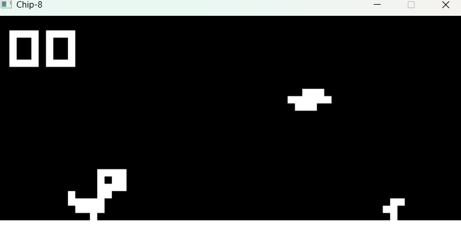

# chip8-rs

A Chip-8 emulator written in Rust from scratch.



## What is Chip-8?

Chip-8 is an interpreted programming language developed in the mid-1970s, originally 
used on 8-bit microcomputers. It was designed to make game development easier and runs 
on a virtual machine with a simple instruction set of 35 opcodes.

## Features

- Complete implementation of all 35 Chip-8 opcodes
- 64x32 pixel display scaled to 640x320
- Sound and delay timers
- Keyboard input
- Built-in fontset for hex digits 0-F

## Building

Requires Rust and Cargo.

```bash
git clone https://github.com/nestorka/chip8-rs
cd chip8-rs
cargo build --release
```

## Running

```bash
cargo run
```

Or place any `.ch8` ROM file in the `roms/` folder and pass the path as argument.

## Controls

Chip-8 has a 16-key hexadecimal keypad mapped to your keyboard:

Chip-8 Keyboard
1 2 3 C 1 2 3 4
4 5 6 D Q W E R
7 8 9 E A S D F
A 0 B F Z X C V

## Technical Details

- **CPU**: 16 x 8-bit registers (V0-VF), 16-bit index register, 16-bit program counter
- **Memory**: 4KB
- **Display**: 64x32 monochrome pixels, XOR rendering
- **Stack**: 16 levels
- **Timers**: Delay and sound timers running at 60Hz
- **Input**: 16-key keypad

## Built With

- [Rust](https://www.rust-lang.org/)
- [minifb](https://github.com/emoon/rust_minifb) — window and pixel buffer
- [rand](https://docs.rs/rand) — random number generation for the RND opcode